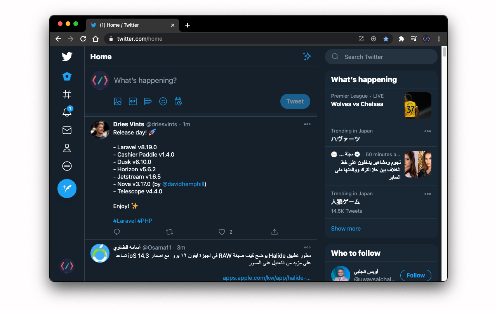
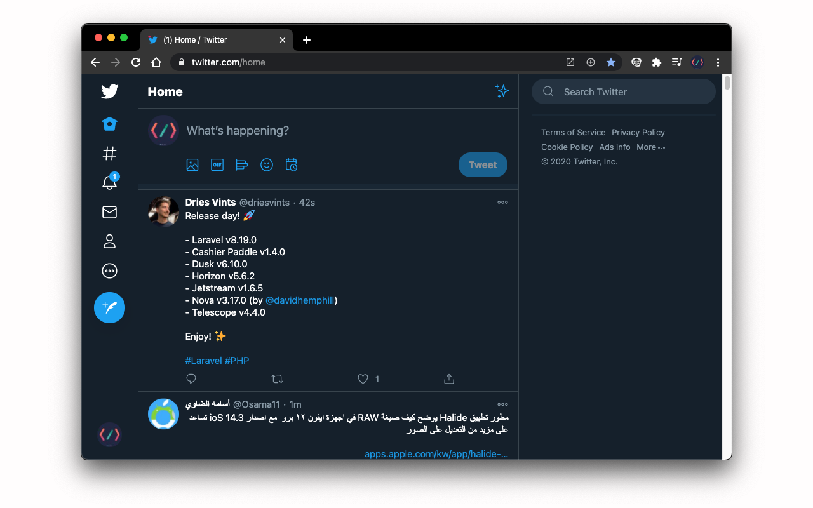

# Hide Twitter Trends 

## Overview

If you don't like the Twitter `Trending now`, `Who to follow`, and `Topics to follow` tabs, and you want to hide it this extension is your solution, this extension will hide Twitter `Trending now`, `Who to follow`, and `Topics to follow` tabs from Twitter web app and let you focus on your timeline.

**NOTE**: Supported languages is `Arabic`, `English`, `Polish`, `Portuguese`, `Japanese`, and `German`.

## Install the extension

* [Google chrome browser](https://chrome.google.com/webstore/detail/hide-twitter-trends/lapmncfnibdclongbkleadoicnkhknia?hl=en&authuser=0)

## Before enable the extension

## After enable the extension

## License

Icons made by [Pixel perfect](https://icon54.com/) from [www.flaticon.com](https://www.flaticon.com/)
