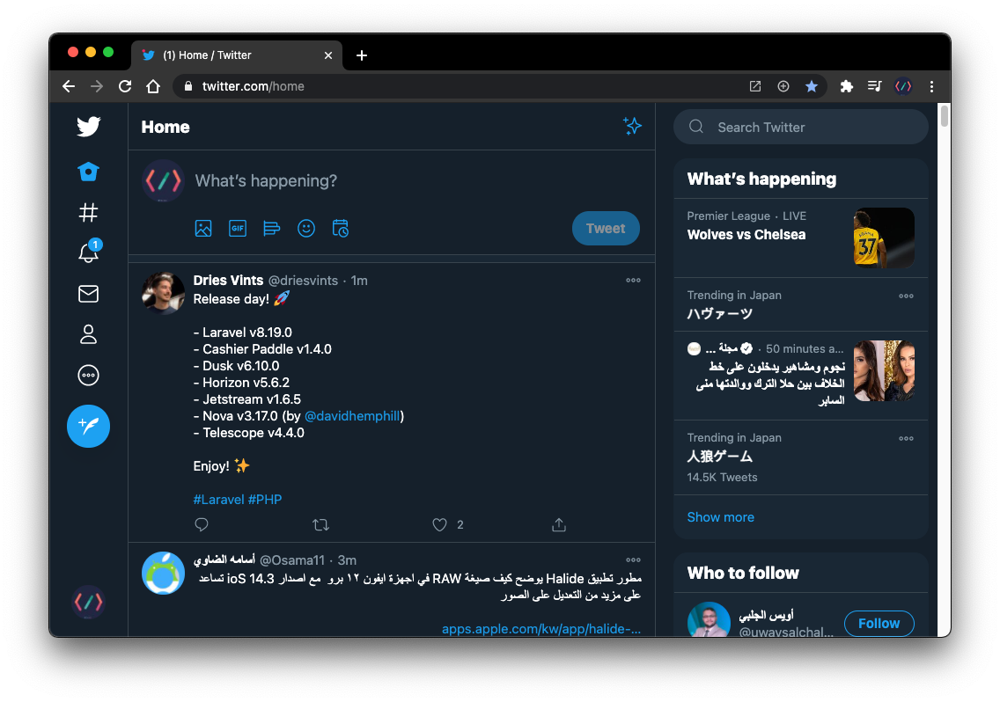
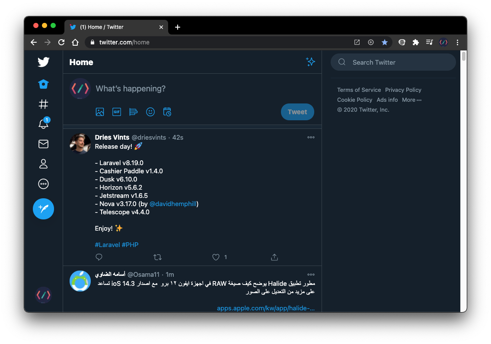

# Hide Twitter Trends 

## Table of Contents

- [Overview](#overview)
    - [Install the extension](#install-the-extension)
    - [Before enable the extension](#before-enable-the-extension)
    - [After enable the extension](#after-enable-the-extension)
- [Contributing](#contributing)
- [Changelog](#changelog)
- [Credits](#credits)
- [License](#license)

## Overview

If you don't like the `twitter trends` and `who to follow` tabs, and you want to hide it this extension is your solution, this extension will hide twitter trends and who to follow tabs from twitter web app and let you focus on your timeline.

**NOTE**: Supported languages is `Arabic`, `English`, `Polish`, `Portuguese`, `Japanese`, and `German`.

### Install the extension

* [Google chrome browser](https://chrome.google.com/webstore/detail/hide-twitter-trends/lapmncfnibdclongbkleadoicnkhknia?hl=en&authuser=0)
* [Firefox browser](https://addons.mozilla.org/en-US/firefox/addon/hide-twitter-trends-side/)

### Before enable the extension

### After enable the extension

## Contributing

Feel free to create pull request and support your language.

## Changelog

Please see [CHANGELOG](CHANGELOG.md) for more information on what has changed recently.

## Credits

- [Moath](https://github.com/devmoath)
- [All Contributors](../../contributors)

## License

Icons made by [Pixel perfect](https://icon54.com/) from [www.flaticon.com](https://www.flaticon.com/)

The MIT License (MIT). Please see [License File](LICENSE.md) for more information.
