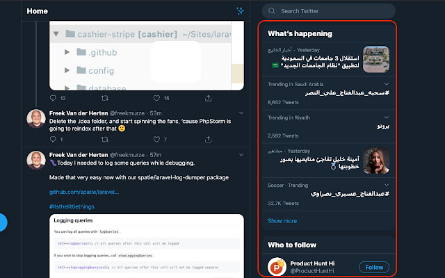
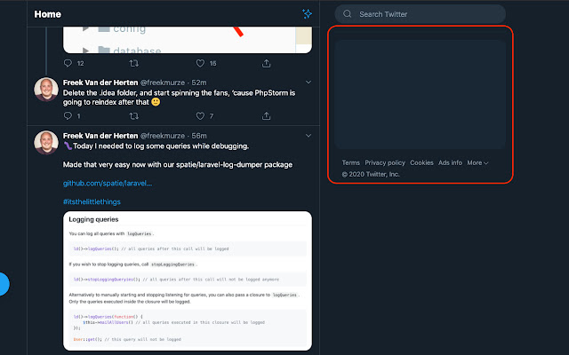

# Hide Twitter Trends 

If you don't like the `twitter trends` and `who to follow` tabs and you want to hide it this extension is your solution, this extension will hide twitter trends and who to follow tabs from twitter web app and let you focus on your timeline.

**Supported languages**: `Arabic`, `English`, `Polish`.

> Feel free to create pull request and support your language.  

### Before enable the extension

### After enable the extension

## Credits

- [DevMoath](https://github.com/devmoath)

## License

The MIT License (MIT). Please see [License File](LICENSE) for more information.
